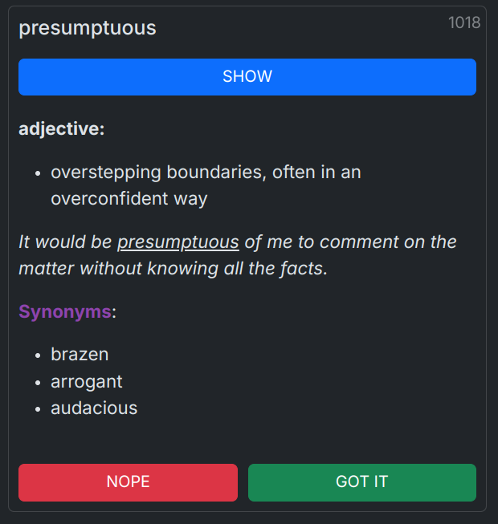

# Gregory II

An app to help with GRE word prep. Contains a collated words from the following lists:

- [GregMat](https://www.gregmat.com/recommended-resources)
- [Magoosh](https://s3.amazonaws.com/magoosh.resources/magoosh-gre-1000-words_oct01.pdf)

## Main Features

- Allows to mark all words that you were confused by and focus your efforts on studying those instead of going through the entire list each time.
- Import and export this data across your devices so that you can learn things on the go and at home.
